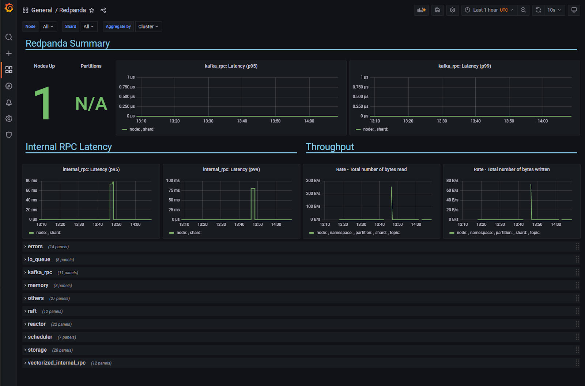

# Monitoring

## Prometheus Configuration

Before starting setting up Redpanda with Prometheus, let's have a quick overview of it.
Prometheus is a monitoring and alerting tool maintained by an active developer and user community; it collects and stores metrics as time-series data.

For more details about Prometheus, check its [website](https://prometheus.io/).

Redpanda exports Prometheus metrics on `<node ip>:9644/metrics`. If you have an
existing Prometheus instance, you can generate the relevant configuration using

```
rpk generate prometheus-config
```

The command will output a YAML object which you can add to the Prometheus config file:

```
- job_name: redpanda-node
  static_configs:
  - targets:
    - 172.31.18.239:9644
    - 172.31.18.238:9643
    - 172.31.18.237:9642
```

If you run the command on a node where Redpanda is running, it will use
Redpanda's Kafka API to discover the other nodes. Otherwise, you can pass
`seed-addr` to specify a remote Redpanda node from which to discover the other
ones, or `--node-addrs` with a comma-separated list of all known cluster node
addresses.

Edit the `prometheus.yml` file located inside the Prometheus root folder to add
the Redpanda configuration under the `scrape_configs`. The number of targets might
change depending on the total of nodes running.
Save the configuration file and restart Prometheus to apply the changes.

## Grafana Configuration

Now that you have the metrics, you need a tool to query, visualize and generate alerts.
Grafana allows you to create dashboards with multiple graphic components using different data sources.
We have selected Prometheus once it is commonly used by applications to expose metrics in our guide.

For more detailed information about Grafana check its [website](https://grafana.com/oss/grafana/).

To generate a comprehensive Grafana dashboard, use the following rpk command:
```
rpk generate grafana-dashboard --datasource <name> --metrics-endpoint <url>
```

`--metrics-endpoint` is the address to a Redpanda node's metrics endpoint
(`<node ip>:9644/metrics`, by default).

`<name>` is the name of the Prometheus data source configured in your
Grafana instance.

Right out of the box, it will generate panels tracking latency for p50, p95, and
p99, throughput, and errors segmentation by type.

Pipe the command's output to a file and import it in Grafana.

```
rpk generate grafana-dashboard \
  --datasource prometheus \
  --metrics-endpoint 172.32.89.236:9644/metrics > redpanda-dashboard.json
```

Now that you have the JSON file with the configuration, it is time to set up Grafana.
Open Grafana in a browser, then hover the add button in the right side menu.
Click on the 'Import' option to upload the generated JSON file.
Once you have selected the desired folder, click on the 'Import' button.
Grafana will then open the new board with information about available Redpanda nodes.

## Grafana Board

As the default setup for the Grafana dashboard, you should see the number of nodes and partitions,
as well latency and throughput graphics:



Each panel relies on data coming from one or more [metrics](#metrics), making it possible to create
your panels.
You can use the imported dashboard to create new panels that meet your needs. For that, click on the plus sign on the left menu bar, then select 'Add a new panel'. Next, in the Query tab, choose Prometheus data source. Now it is time to decide which metric you want to monitor, so click on the 'Metrics browser' and start typing `vectorized` to show all available metrics from the Redpanda cluster.

:::note

Another way to see all the available metrics with their description is to access the cluster via a web browser on `port 9644` (the default port might change depending on your configuration).

:::


Although each metric has a type, you can set the query to calculate the values in the format you desire dynamically.
For instance, if you want to display the total number of partitions in your cluster, use the following query:

```
count(count by (topic,partition) (vectorized_storage_log_partition_size{namespace="kafka"}))
```

Or if you want to show the number of partitions for a specific topic, use:

```
count(count by (topic,partition) (vectorized_storage_log_partition_size{topic="<topic_name>"}))
```

Now you can create your dashboard and always be aware of the cluster status.

## Stats Reporting

Redpanda ships with an additional `systemd` service which executes periodically
and reports resource usage and configuration data to Redpanda's metrics API.
The service, by default, is enabled, and the data is anonymous. If you'd like us to be able
to identify your cluster's data so that we can monitor it and alert you of
possible issues, please set the  `organization` (your company's domain) and
`cluster_id` (usually your team's or project's name) configuration fields. For
example:

```
rpk config set organization 'vectorized.io'
rpk config set cluster_id 'us-west-2'
```

To opt out of all metrics reporting, set `rpk.enable_usage_stats` to false via
`rpk`

```
rpk config set rpk.enable_usage_stats false
```

## Metrics

Through Prometheus, you can access many metrics about the Redpanda process.
Most of the metrics are used for debugging, but these metrics can be useful to measure system health:

| Metric | Definition | Diagnostics |
| --- | --- | --- |
| vectorized_application_uptime | Redpanda uptime in milliseconds |  |
| vectorized_cluster_partition_last_stable_offset | Last stable offset | If this is the last record received by the cluster, then the cluster is up-to-date and ready for maintenance |
| vectorized_io_queue_delay | Total delay time in the queue | Can indicate latency caused by disk operations in seconds |
| vectorized_io_queue_queue_length | Number of requests in the queue | Can indicate latency caused by disk operations |
| vectorized_kafka_rpc_active_connections | kafka_rpc: Currently active connections | Shows the number of clients actively connected |
| vectorized_kafka_rpc_connects | kafka_rpc: Number of accepted connections | Compare to the value at a previous time to derive the rate of accepted connections |
| vectorized_kafka_rpc_received_bytes | kafka_rpc: Number of bytes received from the clients in valid requests | Compare to the value at a previous time to derive the throughput in kafka layer in bytes/sec received |
| vectorized_kafka_rpc_requests_completed | kafka_rpc: Number of successfull requests | Compare to the value at a previous time to derive the messages per sec per shard |
| vectorized_kafka_rpc_requests_pending | kafka_rpc: Number of requests being processed by server |  |
| vectorized_kafka_rpc_sent_bytes | kafka_rpc: Number of bytes sent to clients |  |
| vectorized_kafka_rpc_service_errors | kafka_rpc: Number of service errors |  |
| vectorized_raft_leadership_changes | Number of leadership changes | High value can indicate nodes failing and causing leadership changes |
| vectorized_reactor_utilization | CPU utilization | Shows the true utilization of the CPU by Redpanda process |
| vectorized_storage_log_compacted_segment | Number of compacted segments |  |
| vectorized_storage_log_log_segments_created | Number of created log segments |  |
| vectorized_storage_log_partition_size | Current size of partition in bytes |  |
| vectorized_storage_log_read_bytes | Total number of bytes read |  |
| vectorized_storage_log_written_bytes | Total number of bytes written |  |

These categories of metrics are presented specificly by the seastar component of Redpanda: reactor, memory, scheduler, alien, io_queue