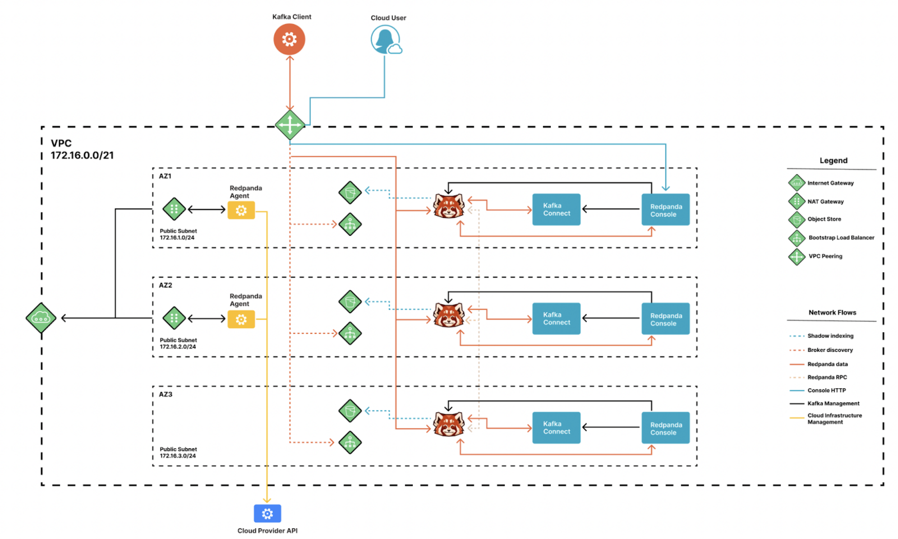
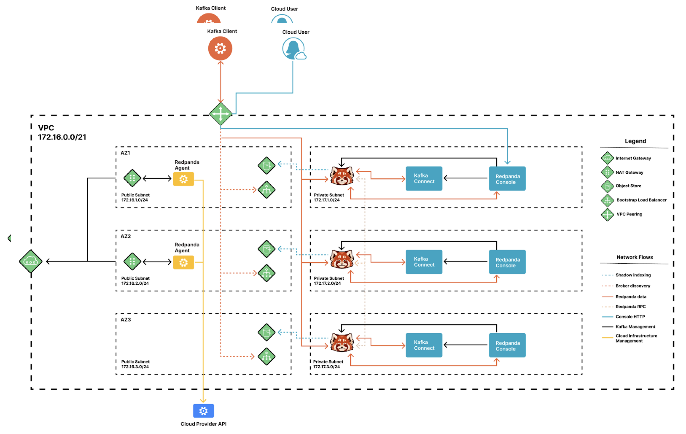

<head>
    <meta name="title" content="Redpanda Cloud Network Design, Ports, and Flows  | Redpanda Docs"/>
    <meta name="description" content="Learn about Redpanda Cloud network design, including ports, and flows."/>
</head>

Redpanda Cloud deploys two different types of networks: one for private and another
for public Redpanda clusters. By default, networks are always laid out across
multiple availability zones (AZ) to enable the creation of one or many single
and multi-AZ Redpanda clusters within them.

## Public Redpanda clusters

Public Redpanda clusters are designed based on the following behaviors:

- There is no network segmentation.
- Redpanda brokers are collocated in the same subnets as the data plane agent.
- Redpanda TCP listeners are protected by SASL/SCRAM (SCRAM-SHA-256, SCRAM-SHA-512)
  authentication and encrypted in transit using TLS 1.2.

## Private Redpanda clusters

Private Redpanda clusters are designed based on the following behaviors:

- There is proper network segmentation.
- All Redpanda services are only accessible from within the same VPC or through
  VPC peerings.
- The data plane agent is placed in public subnets and segmented away by
  firewall rules from Redpanda services.

## Network ports

Network ports are available for North-South, East-West, and South-North as follows.

#### North-South

The following table lists the network ports available to external clients within
each data plane. For private-only Redpanda clusters, access to these ports is
only possible through Redpanda Cloud network connections such as [VPC Peering](../vpc-peering),
Transit Gateway Attachments, or Private Links.

| Service                                | Port                      |
| :--------------------------------------| :------------------------ |
| Kafka API                              | 30092/tcp                 |
| Kafka Bootstrap                        | 9092/tcp                  |
| Schema Registry                        | 30081/tcp                 |
| HTTP Proxy                             | 30082/tcp                 |
| Redpanda Console, Prometheus metrics   | 443/tcp                   |

#### East-West

The following table lists the network ports available within each data plane for
internal communication only.

| Service                                | Port                      |
| :--------------------------------------| :------------------------ |
| Kafka API                              | 30092/tcp                 |
| Kafka Bootstrap                        | 9092/tcp                  |
| Schema Registry                        | 30081/tcp                 |
| HTTP Proxy                             | 30082/tcp                 |
| Redpanda Console                       | 33145/tcp                 |
| Redpanda Admin API                     | 30644/tcp                 |
| Kafka Connect API                      | 8083/tcp                  |

#### South-North

The following network port is used for outgoing network connections.

| Service                                         | Port                      |
| :-----------------------------------------------| :------------------------ |
| Control Plane, Breakglass, Artifact Repository  | 30092/tcp                 |

## AWS Network services

Redpanda Cloud supports the following AWS network services.

- Time synchronization

  Redpanda Cloud in AWS uses Amazon’s Time Sync Service, a fleet of redundant
  satellite-connected and atomic reference clocks in AWS regions.

- Domain Name System (DNS)

  Redpanda Cloud creates a new DNS zone per Redpanda cluster in the control plane
  and delegates its management exclusively to each cluster’s data plane. In turn,
  the data plane creates a hosted zone in Route53, managing DNS records for
  Redpanda services, as needed. All the interactions with Route53 are constrained
  by IAM policies targeted to the specific Route53 resources managed by each data
  plane, following the least privilege principle.

- Distributed denial of service (DDoS) protection

  All Redpanda Cloud services publicly exposed in the control and data planes
  are protected against the most common layer 3 and 4 DDoS attacks by
  [AWS Shield Standard](https://aws.amazon.com/shield/features/#AWS_Shield_Standard),
  with no latency impact.

- [VPC Peering](../vpc-peering)

  Redpanda Cloud supports configuring VPC peering against Redpanda Cloud networks,
  making them available to one or many private Redpanda clusters, and also allows
  users to connect to those clusters without traversing the public internet.

  You can on establish VPC Peering connections between two VPCs with non-overlapping
  network addresses. When creating a Redpanda Cloud network intended for peering,
  enssure that the specified network address range does not overlap with the network
  address range of the destination VPC.

  It is stronly recommended to reject all network traffic initiated from a Redpanda
  cloud network and only accept traffic from Kafka Connectors that connect to
  your internal data stores to retrieve or push data.

## GCP Network services
