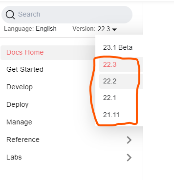
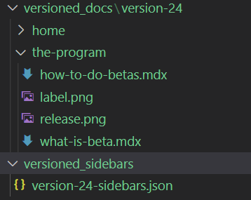

Docusaurus has a [built-in versioning model](https://docusaurus.io/docs/versioning) that creates snapshots of the docs whenever you run their command. 

```javascript
npm run docusaurus docs:version 1.1.0
```

After running this command, Docusaurus creates two new folder, `versioned_docs` and `versioned_sidebars`. 

Versioned docs contains snapshots of the docs from the moment the command was ran, while sidebars does the same but for the sidebar. You can edit those files after running the command. 

The command outputs a version picker with the version number.



## Challenges

While the process is very simple, it can become cumbersome if we have too many versions. The build process is also heavily impacted since you always duplicate your core docs whenever you run the command. 

It is problematic to run betas with Docusaurus's guide because it assumes that your beta docs now go into the folder `docs` while your live docs go into `versioned_docs/<version>`. This is unintuitive to others that are not included in the team. 

## A possible solution

One possible solution to this problem is to treat the betas as diffs rather than fully fledged versions. Remember from [What is beta](../what-is-beta), betas are user-centric tests, so we must help them get to the finish line. 

With this approach, we can create standalone beta pages, that can contain:

- Beta announcement
- Pages that only contain beta content
- More information about the program
- Easy links to the feedback forum

The file tree will look very simple.



With this approach, its very obvious to the user whats in beta. This will also make the merging process simple, because the release manager just have to copy-paste the content into the new version and check with git what are the changes. 

Once the beta ends, the new content gets rolled out into `/docs` and get removed from `versioned_docs/version-24`.