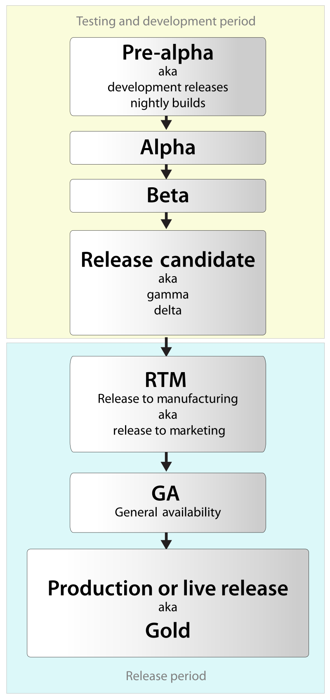

Beta, the second letter in the greek alphabet has important connotations for Computer Science. In a software release life cycle, betas are where we include **the user** to test the software with us. 

It is well understood that for a beta program to begin, an alpha program (without the presence of the users) was already rolled out and deemed stable enough to go to the next round. 

This can be better described in the chart below.

## A focus on the user

Since the beta program should be, in its definition, a user-centric test phase, the developers must guide the user through that journey. 

A successful beta program includes:

- If open beta, how to join the program
- A dedicated forum to gather feedback 
- What is the focus of that beta
- Start and end date of the program
- Patch/release notes   